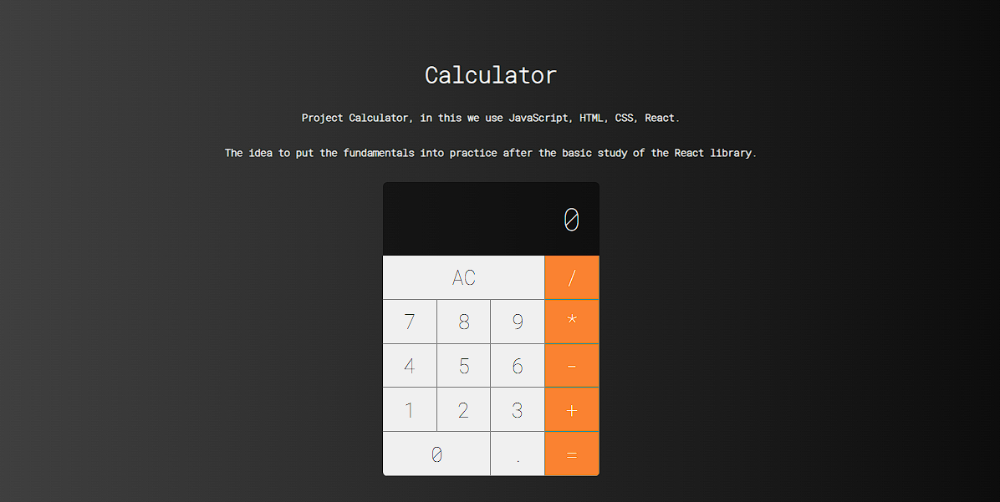

# Calculator
This project is a calculator developed using Javascript, HTML, CSS and React technologies. 

The calculator has a simple interface that allows the user to enter numbers and operators and perform basic arithmetic operations. HTML and CSS are used to create the structure and appearance of the calculator page, while Javascript is used to write the logic code for the calculator, and React is used to create reusable components and manage the state of the calculator.

An idea to put into practice the knowledge acquired after studying the basics of React.

### Getting Started with Create React App

This project was bootstrapped with `create-react-app`

### Available Scripts

In the project directory, you can run:

- Install the dependencies
    #### `npm i`

- Run the project
    #### `npm start`

Runs the app in the development mode.\
Open [http://localhost:3000](http://localhost:3000) to view it in your browser.

The page will reload when you make changes.\
You may also see any lint errors in the console.

### Used tools:
- JavaScript
- HTML
- CSS
- React

 

#### <a href="https://project-calculator-nine.vercel.app/">Link to open the calculator</a>

  
  
Figure 1: Screenshot

